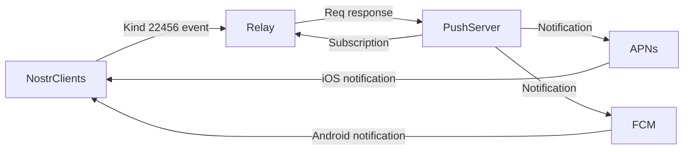

## Welcome to 0xchat

Welcome to 0xChat⚡️

0xchat is a secure chat app built on the Nostr protocol. It prioritizes privacy with features like private key login, encrypted private chats and contacts, coupled with an open communication platform through public channels.

0xchat Download links:

  - [0xchat on iOS](https://apps.apple.com/app/0xchat/id1637607169)
  - [0xchat on Android](https://play.google.com/store/apps/details?id=com.oxchat.nostr)

## Features

### Encrypted Messages

Our direct messages and friends list are secured with end-to-end encryption, ensuring your conversations stay between you and your contacts.

### Open Channels

Explore the boundless realm of open channels with 0xchat. Find and join channels seamlessly, unlocking a world of communication with ease.

### Badge Collections

Make your 0xchat profile uniquely yours with our Badge Collection feature. Gather your favorite badges and proudly display them on your profile picture.

## Technical Highlights 

1. [Secured Private Messages](https://github.com/0xchat-app/0xchat-core/blob/main/doc/friends.md)

	0xchat has optimized private messaging based on NIP04 to prevent leakage of users' real public keys (pubkeys) during private chats. This is achieved by implementing the [NIP101](https://github.com/water783/nips/blob/nip101/101.md) protocol, which creates an alias for users during private conversations.

2. [Push Notifications](https://github.com/0xchat-app/0xchat-core/blob/main/doc/nofitications.md)

	0xchat proposes a method for message push notifications, includes the sending and processing of heartbeat signals to detect online status and provide timely push notifications.
	

## Future Enhancements
We continuously aim to improve and enhance the features. Stay tuned for future updates!

Some important planned features:

- [ ] Threads, mentions, reactions
- [ ] Zap Red Envelopes between friends
- [ ] P2P audio/video calling
- [ ] Private group
- [ ] Audio/video chat room
- [ ] Lightning wallet Integration

