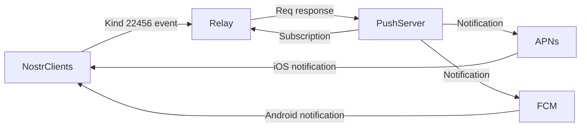

## Welcome to 0xchat

Welcome to 0xChat⚡️

0xchat is a secure chat app built on the Nostr protocol. It prioritizes privacy with features like private key login, encrypted private chats and contacts, coupled with an open communication platform through public channels.

0xchat Download links:

  - [0xchat on iOS](https://apps.apple.com/app/0xchat/id1637607169)
  - [0xchat on Android](https://play.google.com/store/apps/details?id=com.oxchat.nostr)

## Features

**Secure DM**

Currently, we support three types of direct messages (DMs):

- [Normal DM](https://github.com/nostr-protocol/nips/blob/master/04.md)
- [Sealed DM](https://github.com/vitorpamplona/nips/blob/sealed-dms/24.md)
- [Secret DM](https://github.com/0xchat-app/0xchat-core/blob/main/doc/secretChat.md)

Please review the provided links for a deeper understanding of each DM type.

**Open Channels**

Explore the boundless realm of open channels with 0xchat. Find and join channels seamlessly, unlocking a world of communication with ease.

**Audio & Video Call**

We offer audio and video calling capabilities between contacts. Signaling communication is carried out through Nostr relay using [NIP100](https://github.com/jacany/nips/blob/webrtc/100.md). The actual audio and video calls are facilitated via ICE servers. Additionally, we allow users to select their own ICE servers if preferred.

**Badge Collections**

Make your 0xchat profile uniquely yours with our Badge Collection feature. Gather your favorite badges and proudly display them on your profile picture.

**Push Notifications**

0xchat proposes a method for message push notifications, includes the sending and processing of heartbeat signals to detect online status and provide timely push notifications.

Spec link: [https://github.com/0xchat-app/0xchat-core/blob/main/doc/nofitications.md]((https://github.com/0xchat-app/0xchat-core/blob/main/doc/nofitications.md))
	

## Future Enhancements

We continuously aim to improve and enhance the features. Stay tuned for future updates!

Some important planned features:

- [x] Threads, mentions, reactions
- [x] Zap Red Envelopes between friends
- [x] P2P audio/video calling
- [ ] Private group
- [ ] Audio/video chat room
- [ ] Lightning wallet Integration
- [ ] Private notes

